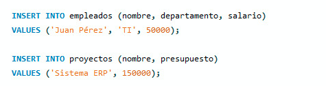
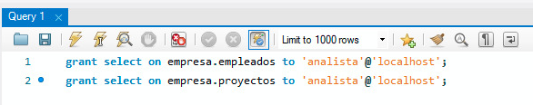

1- creamos la conexion

2-  creamos la base de datos:
    CREATE DATABASE empresa;

    USE empresa;

3- creamos la tabla y agregamos datos:
    

    

4- creamos el usuario analista:
    CREATE USER 'analista'@'localhost' IDENTIFIED BY 'analista123';

5- se dan permisos de solo lectura:
    GRANT USAGE ON empresa.empleados* TO 'analista'@'localhost';
    GRANT USAGE ON empresa.proyectos* TO 'analista'@'localhost';

    

6- aplicamos los cambios
    FLUSH PRIVILEGES;

7- creamos ela ConexionAnalista:
    nombre: analista
    hostname: localhost
    port: 3306
    contraseña: analista123

8- conectamos como analista:
    SELECT * FROM empleados;

9- probamos en agregar datos para probar las restricciones:
    INSERT INTO empleados

    

        

