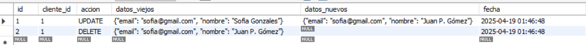
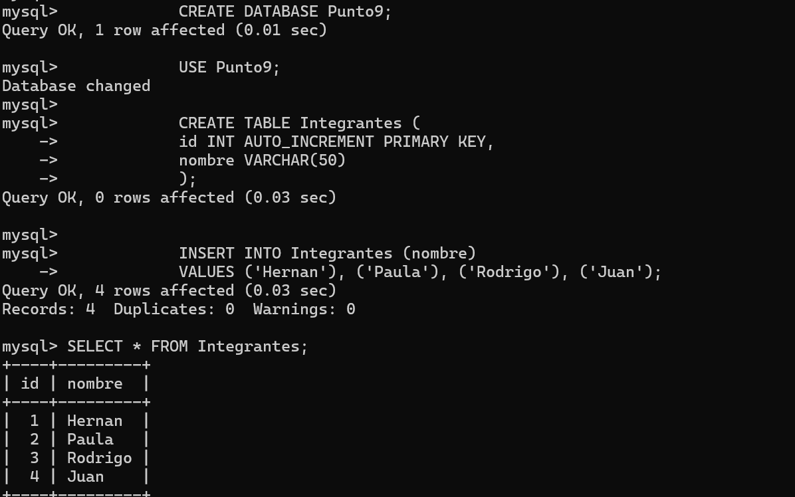
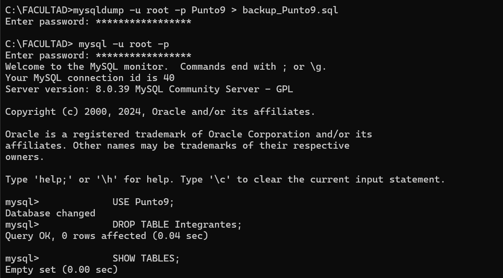
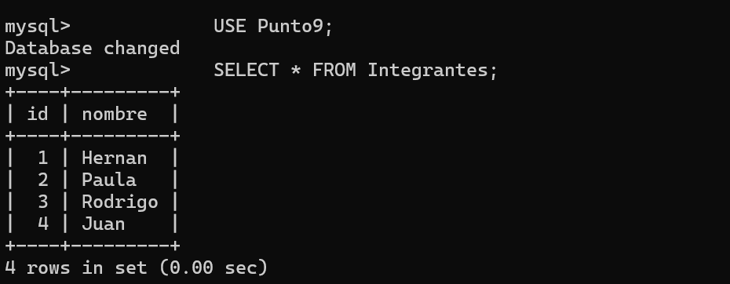

**TRABAJO PÁCTICO 1 - ADMINISTRACIÓN DE BASE DE DATOS**

*Fundamentos, Integridad y Concurrencia*

1. Dado un modelo de base de datos de una universidad, si se eliminara un alumno que tiene cursos asignados existirían algunas violaciones a la integridad de los datos. Por ejemplo, la tabla Inscriptos, que relaciona alumnos con cursos, podría contener un ID de alumno que ya no existe en la tabla Alumno, esto traería problemas e inconsistencias a la hora de realizar consultas o verificar datos. 
Podríamos manejar esto añadiendo acciones a la clave foránea del ID del alumno. Con ON DELETE RESTRICT prevenimos la eliminación de una fila en la tabla padre si existen filas relacionadas en la tabla hija, es decir no podríamos eliminar un alumno si ese alumno está inscripto a cursos.
Ejemplo:
 
            -- Creamos las tablas Alumno, Curso e Inscripcion

            CREATE TABLE Alumno(
            id_alumno INT PRIMARY KEY AUTO_INCREMENT,
            nombre VARCHAR(100)
            ); 

            CREATE TABLE Cursos(
            id_curso INT PRIMARY KEY AUTO_INCREMENT,
            nombre VARCHAR(100)
            );

            CREATE TABLE Inscriptos(
            id_alumno INT,
            id_curso INT,
            fecha DATE,
            FOREIGN KEY (id_alumno) REFERENCES Alumno(id_alumno) ON DELETE RESTRICT, -- Aplicamos las restricciones mencionadas
            FOREIGN KEY (id_curso) REFERENCES Cursos(id_curso) ON DELETE RESTRICT
            );

            -- Ingresamos valores a las tablas
            INSERT INTO Alumno (nombre) VALUES
            ('Martin'),
            ('Claudia'),
            ('Tomas');

            INSERT INTO Cursos (nombre) VALUES
            ('Matematica'),
            ('Lengua'),
            ('Historia');

            INSERT INTO Inscriptos(id_alumno, id_curso, fecha) VALUES
            (1,1,"2025-03-01"), -- Martin se inscribió en Matematica y Lengua
            (1,2,"2025-03-01"),
            (2,3,"2025-03-03"); -- Claudia en Historia

            DELETE FROM Alumno WHERE id_alumno = 1; -- Debería devolvernos este error: Error Code: 1451. Cannot delete or update a parent row: a foreign key constraint fails (`tp1_examples`.`inscriptos`, CONSTRAINT `inscriptos_ibfk_1` FOREIGN KEY (`id_alumno`) REFERENCES `alumno` (`id_alumno`) ON DELETE RESTRICT)	0.000 sec  

2. La tabla Matriculas tiene restricciones de clave foránea hacia la tabla Alumnos. Si intentamos insertar datos que violan la integridad la consola nos mostrará errores, por ejemplo:

            -- Creamos las tablas Alumnos y Matriculas

            CREATE TABLE Alumnos(
            id INT PRIMARY KEY AUTO_INCREMENT,
            nombre VARCHAR(50)
            );

            CREATE TABLE Matriculas(
            id INT PRIMARY KEY AUTO_INCREMENT,
            id_alumno INT,
            pago INT,
            FOREIGN KEY (id_alumno) REFERENCES Alumnos(id) -- Relacionamos la tabla Alumnos con Matriculas
            );

            -- Insertamos datos en la tabla Alumnos

            INSERT INTO Alumnos (nombre) VALUES
            ("Matias"); -- Matias tendra el id 1

            -- Intentamos insertar el id de un alumno que no existe en la tabla Matricula

            INSERT INTO Matriculas(id_alumno, pago) VALUES 
            (3,4000);

            -- La consola nos devolverá el siguiente error

            INSERT INTO Matriculas(id_alumno, pago) VALUES  (3,4000)	Error Code: 1452. Cannot add or update a child row: a foreign key constraint fails (`examples`.`matriculas`, CONSTRAINT `matriculas_ibfk_1` FOREIGN KEY (`id_alumno`) REFERENCES `alumnos` (`id`))	0.031 sec

3. Dos usuarios intentan modificar el saldo de una cuenta en una base de datos al mismo tiempo, utilizaremos dos niveles de aislamiento para ver cómo se comporta cada transacción. READ COMMITED no permite ver datos que no han sido confirmados (commit) y SERIALIZABLE obliga a ejecutar las transacciones en serie, una tras otra.  
Ejemplo 1 READ COMMITTED:

            -- Creamos una cuenta y le insertamos su saldo

            CREATE TABLE Cuenta(
            id INT PRIMARY KEY AUTO_INCREMENT,
            saldo INT
            );

            INSERT INTO Cuenta(saldo) VALUES
            (80000);

            -- Los dos usuarios ejecutan este comando (cada uno en su conexion)

            SET TRANSACTION ISOLATION LEVEL READ COMMITTED; 

            -- El usuario A realiza su transacción:

            START TRANSACTION;
            SELECT saldo FROM Cuenta WHERE id = 1; -- Obtiene el saldo de la cuenta que deberia ser 80000
            UPDATE Cuenta
            SET saldo = saldo - 5000 -- Le descuenta 5000
            WHERE id = 1; -- No hace commit todavia

            -- El usuario B realiza su transacción:

            START TRANSACTION;
            SELECT saldo FROM Cuenta WHERE id = 1; -- Obtiene el saldo (80000), porque el usuario A no hizo commit
            UPDATE Cuenta
            SET saldo = saldo - 5000 -- Le descuenta 5000
            WHERE id = 1; 
            COMMIT;

            -- El usuario A por fin hace el commit
            COMMIT;
            SELECT saldo FROM Cuenta WHERE id = 1; -- 75000

    Conclusión: El usuario A descuenta 5000 al saldo, pero todavía no hace el commit. El usuario B no ve el cambio de A entonces descuenta 5000 al saldo original (80000) y hace el commit. Finalmente A hace el commit y el resultado final queda en 75000 ya que las dos transacciones accedieron al valor original y aplicaron el descuento sobre él.

    Ejemplo 2 SERIALIZABLE:

                -- Creamos una cuenta y le insertamos su saldo

                CREATE TABLE Cuenta(
                id INT PRIMARY KEY AUTO_INCREMENT,
                saldo INT
                );

                INSERT INTO Cuenta(saldo) VALUES
                (80000);

                -- Los dos usuarios ejecutan este comando (cada uno en su conexion)

                SET TRANSACTION ISOLATION LEVEL READ SERIALIZABLE; 

                -- El usuario A realiza su transacción:

                START TRANSACTION;
                SELECT saldo FROM Cuenta WHERE id = 1; -- Obtiene el saldo de la cuenta que deberia ser 80000
                UPDATE Cuenta
                SET saldo = saldo - 5000 -- Le descuenta 5000
                WHERE id = 1; -- No hace commit todavia

                -- El usuario B realiza su transaccion:
                -- Se pone en espera hasta que la primer transacción haga el commit. Entonces, obtiene el valor del saldo actualizado ya con el descuento aplicado (75000)

                START TRANSACTION;
                SELECT saldo FROM Cuenta WHERE id = 1; -- 75000
                UPDATE Cuenta
                SET saldo = saldo - 5000 -- Le descuenta 5000
                WHERE id = 1; 
                COMMIT;

                -- El usuario A por fin hace el commit (ahora la transaccion del usuario B ya puede ejecutarse)

                COMMIT;
                SELECT saldo FROM Cuenta WHERE id = 1; -- 70000

    Conclusión: El usuario A le descuenta 5000 al saldo inicial, pero todavía no hace el commit. El usuario B también desea descontarle 5000 al saldo, pero como ya hay una transacción en ejecución que todavía no ha sido confirmada, se pone en tiempo de espera. Luego el usuario A realiza el commit y por fin se pone en marcha la transacción del usuario B, que obtiene el saldo ya actualizado a 75000. El resultado final es 70000.      

  
*Optimización de Consultas, Índices y Vistas*

4. Utilizaremos la base de datos de más de 100.000 de registros ubicada en el archivo ./SQL/base100k.sql y realizaremos dos consultas una con índice y la otra sin. Usaremos EXPLAIN al principio de cada consulta para revisar el plan de ejecución y comparar su rendimiento.

    Consulta sin índice:   
     
                EXPLAIN SELECT * FROM productos WHERE stock = 0; -- Duración: 0.016 
    

    Consulta con índice:    

                CREATE INDEX idx_stock ON productos(stock);
                EXPLAIN SELECT * FROM productos WHERE stock = 0; -- Duración: 0.000 segundos
    

    Conclusión: con índice se accede directamente a los registros relevantes mejorando el rendimiento y tiempo de respuesta de las consultas.        

5. Supongamos esta tabla:

        CREATE TABLE Productos (
            id INT PRIMARY KEY,
            nombre VARCHAR(100),
            categoria VARCHAR(50),
            precio DECIMAL(10,2),
            stock INT
        );

        Consulta sin índice:

        SELECT * 
        FROM Productos
        WHERE categoria = 'Electrónica' AND precio > 500;

        Crear indices:

        Indice por categoria
        CREATE INDEX idx_categoria ON Productos(categoria);

        Indice por precio
        CREATE INDEX idx_precio ON Productos(precio);

        Indice combinado
        CREATE INDEX idx_categoria_precio ON Productos(categoria, precio);

        Medir rendimiento:
        Usá EXPLAIN para ver el plan de ejecución y ver qué índice se utiliza:

        EXPLAIN SELECT * 
        FROM Productos
        WHERE categoria = 'Electrónica' AND precio > 500;

        Comparacion:
        El índice combinado idx_categoria_precio deberia ser el más eficiente para esta consulta que filtra por ambos campos.
        Los otros dos pueden ayudar pero no seran tan optimos porque cada uno cubre solo una condicion.

6. 
    -Creamos las tablas necesarias  

        CREATE TABLE Productos (
            id_producto SERIAL PRIMARY KEY,
            nombre VARCHAR(100)
        );
        CREATE TABLE Ventas (
            id SERIAL PRIMARY KEY,
            id_producto INT REFERENCES Productos(id_producto),
            fecha DATE,
            cantidad INT
        );

    -Vista de las ventas mensuales

        CREATE VIEW VentasMensuales AS
        SELECT 
            id_producto,
            DATE_TRUNC('month', fecha) AS mes,
            SUM(cantidad) AS total_vendido
        FROM Ventas
        GROUP BY id_producto, mes;

    -Consulta para saber los 5 productos mas vendidos

        SELECT 
        p.nombre, 
        SUM(vm.total_vendido) AS total_vendido
        FROM VentasMensuales vm
        JOIN Productos p ON p.id_producto = vm.id_producto
        GROUP BY p.nombre
        ORDER BY total_vendido DESC
        LIMIT 5;

*Administración, Seguridad y Mantenimiento*   
 
8. Simulación de auditoría simple con triggers que registren toda modificación en la tabla Clientes: 

            -- Creamos la tabla clientes

            CREATE TABLE clientes (
                id INT AUTO_INCREMENT PRIMARY KEY,
                nombre VARCHAR(100),
                email VARCHAR(100)
            );

            -- Creamos la tabla auditoría

            CREATE TABLE auditoria (
                id INT AUTO_INCREMENT PRIMARY KEY,
                cliente_id INT,
                accion VARCHAR(10),
                datos_viejos JSON,
                datos_nuevos JSON,
                fecha DATETIME DEFAULT CURRENT_TIMESTAMP
            );

            -- Creamos un trigger para cuando se modifique la tabla clientes (UPDATE)

            DELIMITER $$

            CREATE TRIGGER trigger_auditoria
            AFTER UPDATE ON clientes
            FOR EACH ROW
            BEGIN
                INSERT INTO auditoria (
                    accion,
                    cliente_id,
                    datos_viejos,
                    datos_nuevos
                ) VALUES (
                    'UPDATE',
                    OLD.id,
                    JSON_OBJECT('nombre', OLD.nombre, 'email', OLD.email),
                    JSON_OBJECT('nombre', NEW.nombre, 'email', NEW.email)
                );
            END$$

            DELIMITER ;

        -- Creamos un trigger para cuando se elimine alguna fila de la tabla clientes (DELETE)

            DELIMITER $$

            CREATE TRIGGER trigger_auditoria_delete
            AFTER DELETE ON clientes
            FOR EACH ROW
            BEGIN
                INSERT INTO auditoria (
                    accion,
                    cliente_id,
                    datos_viejos
                ) VALUES (
                    'DELETE',
                    OLD.id,
                    JSON_OBJECT('nombre', OLD.nombre, 'email', OLD.email)
                );
            END$$

            DELIMITER ;

            -- Insertamos un cliente

            INSERT INTO clientes (nombre, email) VALUES ('Sofia Gonzales', 'sofia@gmail.com');

            -- Probamos si funcionan los triggers 

            UPDATE clientes -- Modificamos un cliente
            SET nombre = 'Juan P. Gómez'
            WHERE id = 1;

            DELETE FROM clientes WHERE id = 1; -- Eliminamos un cliente

            SELECT * FROM auditoria; -- Vemos si se guardaron los datos en la tabla

    Deberíamos ver la tabla auditoria de esta manera: 
  

9. Backup de base de datos, simulación de pérdida y restauración de los datos en MySQL.  
    Para hacer un backup necesitamos usar una base de datos existente o crear una. Crearemos una para usar en este ejemplo:

            CREATE DATABASE Punto9;
            USE Punto9;

            CREATE TABLE Integrantes (
            id INT AUTO_INCREMENT PRIMARY KEY,
            nombre VARCHAR(50)
            );

            INSERT INTO Integrantes (nombre)
            VALUES ('Hernan'), ('Paula'), ('Rodrigo'), ('Juan');
    
    
    Una vez creada la base de datos, abrimos la consola y ejecutamos el siguiente comando para hacer el backup:

            mysqldump -u root -p Punto9 > backup_Punto9.sql

    Luego simularemos la pérdida de datos eliminando la tabla Integrantes:

            USE Punto9;
            DROP TABLE Integrantes;
            SHOW TABLES;
    

    Volvemos a la consola y restauramos el backup:

            mysql -u root -p Punto9 < backup_Punto9.sql

    Verificamos en MySQL si se recuperaron los datos borrados:

            USE Punto9;
            SELECT * FROM Integrantes;
    

        

