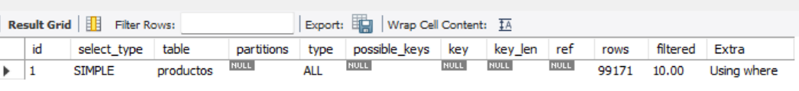
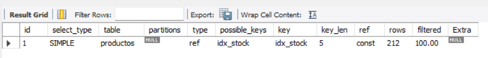

**TRABAJO PRACTICO 1 - ADMINISTRACION DE BASE DE DATOS**

*Fundamentos, Integridad y Concurrencia*

1. Dado un modelo de base de datos de una universidad, si se eliminara un alumno que tiene cursos asignados existirían algunas violaciones a la integridad de los datos. Por ejemplo, la tabla Inscriptos, que relaciona alumnos con cursos, podría contener un ID de alumno que ya no existe en la tabla Alumno, esto traería problemas e inconsistencias a la hora de relizar consultas o verificar datos. 
Podriamos manejar esto añadiendo acciones a la clave foránea del ID del alumnno. Con ON DELETE RESTRICT prevenimos la eliminación de una fila en la tabla padre si existen filas relacionadas en la tabla hija, es decir no podríamos eliminar un alumno si ese alumno esta inscripto a cursos.
Ejemplo:
 
            -- Creamos las tablas Alumno, Curso e Inscripcion

            CREATE TABLE Alumno(
            id_alumno INT PRIMARY KEY AUTO_INCREMENT,
            nombre VARCHAR(100)
            ); 

            CREATE TABLE Cursos(
            id_curso INT PRIMARY KEY AUTO_INCREMENT,
            nombre VARCHAR(100)
            );

            CREATE TABLE Inscriptos(
            id_alumno INT,
            id_curso INT,
            fecha DATE,
            FOREIGN KEY (id_alumno) REFERENCES Alumno(id_alumno) ON DELETE RESTRICT, -- Aplicamos las restricciones mencionadas
            FOREIGN KEY (id_curso) REFERENCES Cursos(id_curso) ON DELETE RESTRICT
            );

            -- Ingresamos valores a las tablas
            INSERT INTO Alumno (nombre) VALUES
            ('Martin'),
            ('Claudia'),
            ('Tomas');

            INSERT INTO Cursos (nombre) VALUES
            ('Matematica'),
            ('Lengua'),
            ('Historia');

            INSERT INTO Inscriptos(id_alumno, id_curso, fecha) VALUES
            (1,1,"2025-03-01"), -- Martin se incribio en Matematica y Lengua
            (1,2,"2025-03-01"),
            (2,3,"2025-03-03"); -- Claudia en Historia

            DELETE FROM Alumno WHERE id_alumno = 1; -- Deberia devolvernos este error: Error Code: 1451. Cannot delete or update a parent row: a foreign key constraint fails (`tp1_examples`.`inscriptos`, CONSTRAINT `inscriptos_ibfk_1` FOREIGN KEY (`id_alumno`) REFERENCES `alumno` (`id_alumno`) ON DELETE RESTRICT)	0.000 sec  

2. La tabla Marticulas tiene restricciones de clave foranea hacia la tabla Alumnos. Si intentamos insertar datos que violan la integridad la consola nos mostrara errores, por ejemplo:

            -- Creamos las tablas Alumnos y Matriculas

            CREATE TABLE Alumnos(
            id INT PRIMARY KEY AUTO_INCREMENT,
            nombre VARCHAR(50)
            );

            CREATE TABLE Matriculas(
            id INT PRIMARY KEY AUTO_INCREMENT,
            id_alumno INT,
            pago INT,
            FOREIGN KEY (id_alumno) REFERENCES Alumnos(id) -- Relacionamos la tabla Alumnos con Matriculas
            );

            -- Insertamos datos en la tabla Alumnos

            INSERT INTO Alumnos (nombre) VALUES
            ("Matias"); -- Matias tendra el id 1

            -- Intentamos insertar el id de un alumno que no existe en la tabla Matricula

            INSERT INTO Matriculas(id_alumno, pago) VALUES 
            (3,4000);

            -- La consola nos devolvera el siguiente error

            INSERT INTO Matriculas(id_alumno, pago) VALUES  (3,4000)	Error Code: 1452. Cannot add or update a child row: a foreign key constraint fails (`examples`.`matriculas`, CONSTRAINT `matriculas_ibfk_1` FOREIGN KEY (`id_alumno`) REFERENCES `alumnos` (`id`))	0.031 sec

3. Dos usuarios intentan modificar el saldo de una cuenta en una base de datos al mismo tiempo, utilizaremos dos niveles de aislamiento para ver como se comporta cada transaccion. READ COMMITED no permite ver datos que no han sido confirmados (commit) y SERIALIZABLE obliga a ejecutar las transacciones en serie, una tras otra.  
Ejemplo 1 READ COMMITED:

            -- Creamos una cuenta y le insertamos su saldo

            CREATE TABLE Cuenta(
            id INT PRIMARY KEY AUTO_INCREMENT,
            saldo INT
            );

            INSERT INTO Cuenta(saldo) VALUES
            (80000);

            -- Los dos usuarios ejecutan este comando (cada uno en su conexion)

            SET TRANSACTION ISOLATION LEVEL READ COMMITTED; 

            -- El usuario A realiza su transaccion:

            START TRANSACTION;
            SELECT saldo FROM Cuenta WHERE id = 1; -- Obtiene el saldo de la cuenta que deberia ser 80000
            UPDATE Cuenta
            SET saldo = saldo - 5000 -- Le descuenta 5000
            WHERE id = 1; -- No hace commit todavia

            -- El usuario B realiza su transaccion:

            START TRANSACTION;
            SELECT saldo FROM Cuenta WHERE id = 1; -- Obtiene el saldo (80000), porque el usuario A no hizo commit
            UPDATE Cuenta
            SET saldo = saldo - 5000 -- Le descuenta 5000
            WHERE id = 1; 
            COMMIT;

            -- El usuario A por fin hace el commit
            COMMIT;
            SELECT saldo FROM Cuenta WHERE id = 1; -- 75000

    Conclusion: El usuario A descuenta 5000 al saldo, pero todavia no hace el commit. El usuario B no ve el cambio de A entonces descuenta 5000 al saldo original (80000) y hace el commit. Finalmente A hace el commit y el resultado final queda en 75000 ya que las dos transacciones accedieron al valor original y aplicaron el descuento sobre el.

    Ejemplo 2 SERIALIZABLE:

                -- Creamos una cuenta y le insertamos su saldo

                CREATE TABLE Cuenta(
                id INT PRIMARY KEY AUTO_INCREMENT,
                saldo INT
                );

                INSERT INTO Cuenta(saldo) VALUES
                (80000);

                -- Los dos usuarios ejecutan este comando (cada uno en su conexion)

                SET TRANSACTION ISOLATION LEVEL READ SERIALIZABLE; 

                -- El usuario A realiza su transaccion:

                START TRANSACTION;
                SELECT saldo FROM Cuenta WHERE id = 1; -- Obtiene el saldo de la cuenta que deberia ser 80000
                UPDATE Cuenta
                SET saldo = saldo - 5000 -- Le descuenta 5000
                WHERE id = 1; -- No hace commit todavia

                -- El usuario B realiza su transaccion:
                -- Se pone en espera hasta que la primer transaccion haga el commit. Entonces, obtiene el valor del saldo actualizado ya con el descuento aplicado (75000)

                START TRANSACTION;
                SELECT saldo FROM Cuenta WHERE id = 1; -- 75000
                UPDATE Cuenta
                SET saldo = saldo - 5000 -- Le descuenta 5000
                WHERE id = 1; 
                COMMIT;

                -- El usuario A por fin hace el commit (ahora la transaccion del usuario B ya puede ejecutarse)

                COMMIT;
                SELECT saldo FROM Cuenta WHERE id = 1; -- 70000

    Conclusion: El usuario A le descuenta 5000 al saldo inicial, pero todavia no hace el commit. El usuario B tambien desea descontarle 5000 al saldo, pero como ya hay una transaccion en ejecucion que todavia no ha sido confirmada, se pone en tiempo de espera. Luego el usuario A realiza el commit y por fin se pone en marcha la transaccion del usuario B, que obtiene el saldo ya actualizado a 75000. El resultado final es 70000.      

  
*Optimizacion de Consultas,Indices y Vistas*

4. Utilizaremos la base de datos de mas de 100k de registros ubicada en el archivo ./SQL/base100k.sql y realizaremos dos consultas una con indice y la otra sin. Usaremos EXPLAIN al princippio de cada consulta para revisar el plan de ejecucion y comparar su rendimiento.

    Consulta sin indice:   
     
                EXPLAIN SELECT * FROM productos WHERE stock = 0; -- Duracion: 0.016 
    

    Consulta con indice:    

                CREATE INDEX idx_stock ON productos(stock);
                EXPLAIN SELECT * FROM productos WHERE stock = 0; -- Duracion: 0.000 segundos
    

    Conclusion: con indice se accede directamente a los regristros relevantes mejorando el rendiemiento ytiempo de respuesta de las consultas.

        

